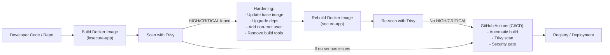
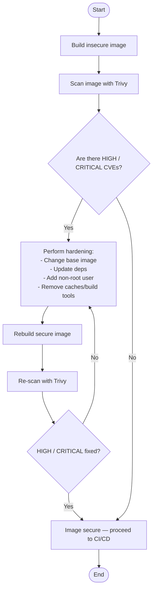

# DevSecOps Week 7

## Docker Security with Trivy


---

## 1. Overview

Dokumentasi ini merupakan laporan lengkap praktik DevSecOps Week 7 tentang keamanan Docker image menggunakan **Trivy**.
Proses dimulai dari pembuatan image tidak aman, scanning CVE, hardening Dockerfile, pembandingan hasil scan, hingga integrasi **Trivy ke GitHub Actions sebagai security gate**.

Tujuannya agar setiap perubahan kode secara otomatis dipindai dan mencegah image rentan masuk ke pipeline produksi.

---

## 2. Diagram Arsitektur



---

## 3. Flowchart Scanning & Hardening



---

## 4. Konsep Dasar Keamanan Docker

Keamanan container mencakup:

* Image (base image, library, dependency)
* Container runtime (proses yang berjalan)
* Host OS (kernel)
* Registry (sumber image)
* CI/CD pipeline (otomatisasi build dan deploy)

Ancaman utama:

* Base image usang
* Container berjalan sebagai root
* Misconfiguration
* Image berbahaya
* Secrets tersimpan di Dockerfile

---

## 5. Aplikasi dan Dockerfile Tidak Aman

### 5.1 app.py

```
from flask import Flask
app = Flask(__name__)
@app.route("/")
def home():
    return "Hello DevSecOps"
if __name__ == "__main__":
    app.run(host="0.0.0.0", port=5000)
```

### 5.2 Dockerfile insecure

```
FROM python:3.8
WORKDIR /app
COPY . /app
RUN pip install flask==1.0
EXPOSE 5000
CMD ["python", "app.py"]
```

Build:

```
docker build -t insecure-app:1 .
docker save insecure-app:1 -o insecure-app.tar
```

---

## 6. Scanning Image Tidak Aman dengan Trivy

### Scan Table

```
docker run --rm -v "%cd%:/scan" aquasec/trivy:latest image --input /scan/insecure-app.tar --format table --output /scan/trivy-insecure.txt
```

### Scan JSON

```
docker run --rm -v "%cd%:/scan" aquasec/trivy:latest image --input /scan/insecure-app.tar --format json --output /scan/trivy-insecure.json
```

### Cek CVE High/Critical

```
findstr /i "HIGH CRITICAL" trivy-insecure.txt
```

Hasil: Banyak CVE High/Critical ditemukan.

---

## 7. Hardening Dockerfile

Dockerfile secure:

```
FROM python:3.12-slim
WORKDIR /app
COPY . /app
RUN pip install --no-cache-dir flask==2.3.2
RUN adduser --disabled-password appuser
USER appuser
EXPOSE 5000
CMD ["python", "app.py"]
```

Build:

```
docker build -t secure-app:1 .
docker save secure-app:1 -o secure-app.tar
```

---

## 8. Scan Ulang Image Aman

```
docker run --rm -v "%cd%:/scan" aquasec/trivy:latest image --input /scan/secure-app.tar --format table --output /scan/trivy-secure.txt
```

Cek hasil:

```
findstr /i "HIGH CRITICAL" trivy-secure.txt
```

Hasil: Tidak ditemukan CVE High/Critical.

---

## 9. Perbandingan Severity

### Hitung severity (PowerShell)

Sebelum:

```
powershell -Command "Get-Content trivy-insecure.json | ConvertFrom-Json | Select-Object -Expand Results | Select-Object -Expand Vulnerabilities | Group-Object Severity | Format-Table Count, Name > severity-insecure.txt"
```

Sesudah:

```
powershell -Command "Get-Content trivy-secure.json | ConvertFrom-Json | Select-Object -Expand Results | Select-Object -Expand Vulnerabilities | Group-Object Severity | Format-Table Count, Name > severity-secure.txt"
```

Hasil:

* HIGH/CRITICAL hilang
* MEDIUM/LOW turun drastis

---

## 10. Penjelasan CVE (Singkat)

### CVE-2025-53014 (ImageMagick – Critical)

Heap buffer overflow saat memproses file gambar. Potensi RCE.
Fix: `8:6.9.11.60+dfsg-1.6+deb12u4`

### CVE-2023-6879 (libaom3 – Critical)

Overflow saat perubahan ukuran frame video. Potensi crash atau memory corruption.

### CVE-2023-5841 (libopenexr – Critical)

Heap overflow pada parsing deep scanline EXR.

---

## 11. Mitigasi Keamanan

Dilakukan mitigasi:

* Update dependency (Flask 2.3.2)
* Ganti base image minimal (python:3.12-slim)
* Non-root user
* Optimize layer (`--no-cache-dir`)
* Hindari secrets di Dockerfile

Rekomendasi jangka panjang:

* Update rutin base image & package
* Automasi scanning CI/CD
* Gunakan secrets manager
* Runtime monitoring (Falco)

---

## 12. Integrasi GitHub Actions

File workflow:

### `.github/workflows/trivy.yml`

```
name: Trivy Image Scan

on:
  push:
    branches: [ main ]
  pull_request:
    branches: [ main ]

jobs:
  trivy-scan:
    runs-on: ubuntu-latest
    permissions:
      contents: read

    steps:
      - name: Checkout repository
        uses: actions/checkout@v4

      - name: Set up QEMU
        uses: docker/setup-qemu-action@v2

      - name: Set up Docker Buildx
        uses: docker/setup-buildx-action@v2

      - name: Build Docker image
        run: |
          set -euo pipefail
          REPO_OWNER=$(echo "${{ github.repository_owner }}" | tr '[:upper:]' '[:lower:]')
          REPO_NAME=$(echo "${{ github.event.repository.name }}" | tr '[:upper:]' '[:lower:]')
          docker build -t ghcr.io/$REPO_OWNER/$REPO_NAME:scan-latest .

      - name: Install Trivy via APT repo
        run: |
          set -euo pipefail
          sudo apt-get update
          sudo apt-get install -y gnupg wget apt-transport-https lsb-release
          wget -qO - https://aquasecurity.github.io/trivy-repo/deb/public.key | gpg --dearmor | sudo tee /usr/share/keyrings/trivy.gpg > /dev/null
          echo "deb [signed-by=/usr/share/keyrings/trivy.gpg] https://aquasecurity.github.io/trivy-repo/deb $(lsb_release -cs) main" | sudo tee /etc/apt/sources.list.d/trivy.list
          sudo apt-get update
          sudo apt-get install -y trivy
          trivy --version

      - name: Run Trivy Scan (fail on HIGH/CRITICAL) and save output
        run: |
          set -euo pipefail
          REPO_OWNER=$(echo "${{ github.repository_owner }}" | tr '[:upper:]' '[:lower:]')
          REPO_NAME=$(echo "${{ github.event.repository.name }}" | tr '[:upper:]' '[:lower:]')

          # Run trivy and capture its exit code while saving output to file
          # trivy exit codes: 0 = no vulnerabilities found (or below severity filter)
          #                     1 = vulnerabilities found (for severity filter) -> we want to fail pipeline
          trivy image --exit-code 1 --severity HIGH,CRITICAL --format table ghcr.io/$REPO_OWNER/$REPO_NAME:scan-latest | tee trivy-output.txt
          rc=${PIPESTATUS[0]:-0}
          if [ "$rc" -eq 1 ]; then
            echo "Trivy found HIGH/CRITICAL vulnerabilities (exit code $rc). See trivy-output.txt"
            exit 1
          elif [ "$rc" -ne 0 ]; then
            echo "Trivy returned unexpected exit code $rc"
            exit $rc
          else
            echo "No HIGH/CRITICAL vulnerabilities found."
          fi

      - name: Upload Trivy Output
        if: always()
        uses: actions/upload-artifact@v4
        with:
          name: trivy-output
          path: trivy-output.txt
```

---

## 13. Kesimpulan

Praktik DevSecOps Week 7 menunjukkan bahwa hardening Dockerfile secara signifikan mengurangi kerentanan dalam image. Base image modern, dependency terbaru, konfigurasi non-root, dan optimasi layer terbukti efektif menghilangkan CVE Critical/High.
Integrasi Trivy ke GitHub Actions memastikan proses scanning berjalan otomatis sehingga keamanan menjadi bagian konsisten dari pipeline DevSecOps.
